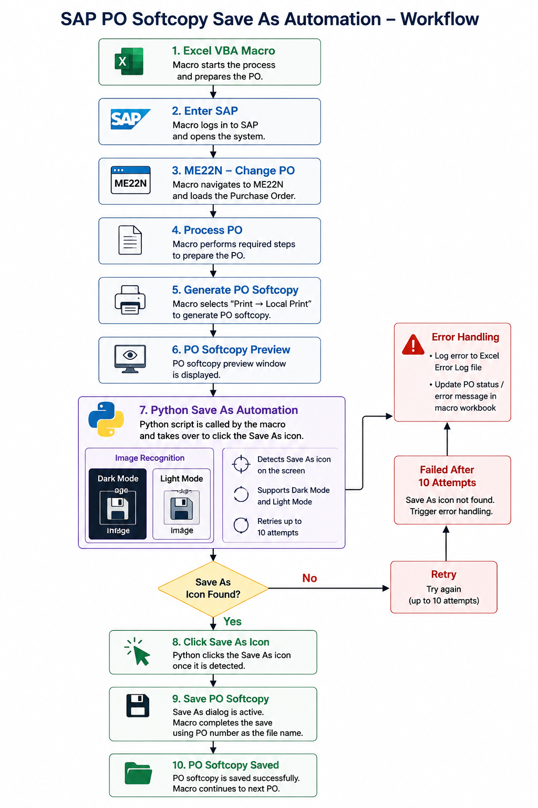
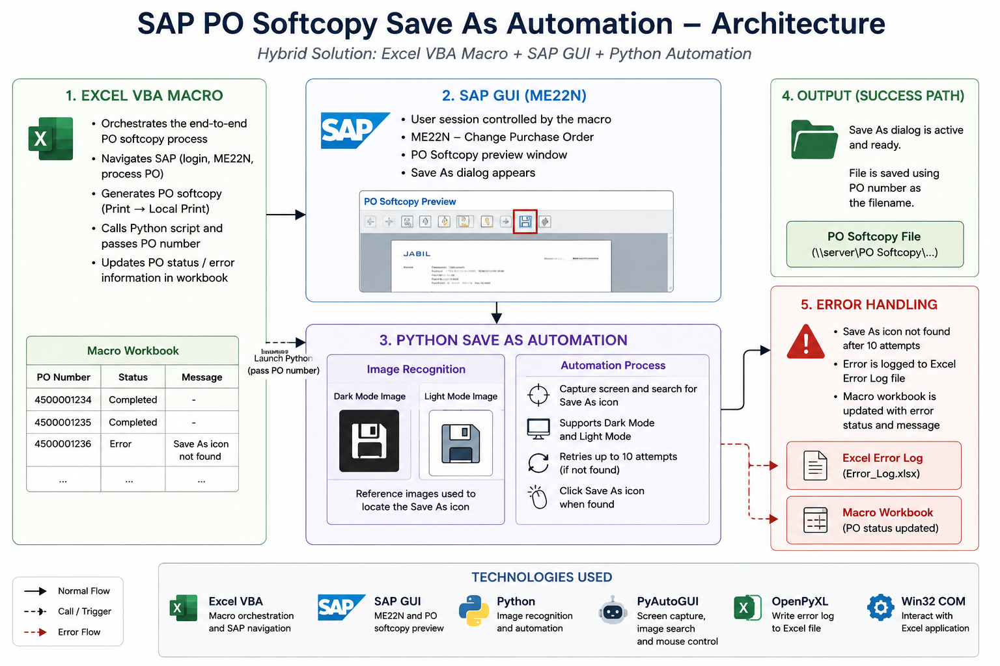

# Click Save As Automation

Status: Production

## Overview

Python automation developed to improve the reliability of an existing SAP Purchase Order (PO) softcopy saving workflow. The solution uses OpenCV-based UI element detection instead of relying entirely on fixed screen coordinates.

## Problem

The existing desktop automation depended on fixed screen coordinates. Changes in screen resolution, display scaling, or application layout could cause the automation to click the wrong location or fail to locate the Save As function.

## Solution

A Python component was developed to dynamically detect the Save As UI element using OpenCV template matching. The detected screen position is then used by PyAutoGUI to perform the required interaction.

The Python component works as part of an existing Excel VBA and SAP GUI workflow.

## Workflow

## Architecture

## Technologies

- Python
- OpenCV
- NumPy
- PyAutoGUI
- PyWin32
- OpenPyXL
- Excel VBA
- SAP GUI

## Key Features

* OpenCV template matching
* Multi-scale UI element detection
* Configurable OpenCV matching threshold
* Retry handling for UI detection
* PO number normalization for Excel/VBA comparison
* Excel-based error reporting
* Support for different local desktop environments

## Error Handling

The automation retries UI detection when the target element cannot be identified immediately. Errors are recorded in an Excel error log to support troubleshooting of failed processing.

## Configuration

`utils/constant.example.py` provides the configuration template.

Actual local configuration values are kept outside the public repository through `.gitignore`.

The runtime template images are stored in the user's local `PO Softcopy` folders. Images included in this repository are reference/sample assets for documentation and demonstration.

## My Role

I developed the Python component that detects the SAP Save As UI element and performs the required desktop interaction. I also implemented the OpenCV matching logic, retry handling, configuration, and Excel error reporting required by the automation workflow.

## Business Impact

The solution addresses a practical reliability problem in an existing SAP Purchasing automation workflow by reducing dependence on fixed screen coordinates.

## Limitations

* The automation depends on the expected SAP/application UI appearance.
* Runtime template images must be available in the configured local location.
* The solution is intended for the specific workflow and environment for which it was developed.
* No automated test suite is currently included.

## Future Improvements

Potential improvements include packaging runtime assets with the application, improving UI detection robustness, adding automated tests, and further separating configuration from application logic.

## Disclaimer

This repository contains sanitized code and sample/reference assets for portfolio demonstration. Production files, company-specific data, credentials, and confidential information are not included.
