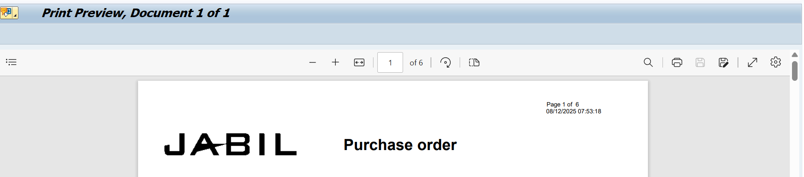

# SAP PO Softcopy Save As Automation


> Python automation component integrated with an existing Excel VBA and SAP PO Softcopy workflow to replace resolution-dependent screen coordinates with image-based Save As detection.

---

## Overview

This project is a Python component used as part of an existing Excel VBA automation for processing SAP Purchase Order (PO) softcopies.

The original VBA automation navigates SAP, processes the Purchase Order through `ME22N`, generates the PO softcopy, and reaches the Save As screen.

The original implementation used fixed screen coordinates to click the Save As icon.

This created a reliability issue because different monitor resolutions, display configurations, or screen layouts could cause the fixed coordinates to point to the wrong location.

The Python component was introduced to solve this specific problem.

Instead of relying on a fixed screen coordinate, Python uses image recognition to locate the actual Save As icon on the screen and click its detected position.

**Project Status:** Production

---

## Business Problem

The existing PO Softcopy automation relied on a fixed screen coordinate to click the SAP Save As icon.

For example:

```text
Fixed X/Y Coordinate
        ↓
Click Save As
```

This approach can become unreliable when the user's environment changes.

Potential differences include:

- Monitor resolution.
- Display scaling.
- Screen layout.
- SAP window position.
- Different SAP themes.

When the Save As icon moves, the original coordinate may no longer point to the correct location.

This can interrupt the automated PO Softcopy process.

---

## Solution

A Python automation component was introduced to replace the fixed-coordinate interaction with image-based detection.

The Python component:

1. Receives the PO number from the surrounding VBA workflow.
2. Locates the Dark Mode and Light Mode Save As reference images.
3. Captures the current screen.
4. Uses OpenCV template matching to search for the Save As icon.
5. Searches across multiple image scales.
6. Detects the best matching location.
7. Checks whether the match meets the required confidence threshold.
8. Moves to the detected location.
9. Clicks the Save As icon.
10. Retries the detection process when the icon cannot be found.
11. Records an error if the Save As icon cannot be detected after the configured retries.

The Python component focuses specifically on the Save As interaction while the surrounding VBA macro remains responsible for the overall SAP PO Softcopy workflow.

---

## Key Features

### Image-Based Save As Detection

The automation uses OpenCV template matching instead of relying on a fixed screen coordinate.

This allows the Save As icon to be detected based on its visual appearance and current screen position.

---

### Dark Mode and Light Mode Support

The automation supports two Save As reference images:

```text
Dark Mode
Light Mode
```

The script attempts to detect the Save As icon using both reference images.

---

### Multi-Scale Detection

The image recognition process searches across multiple template scales.

This helps reduce dependency on the exact displayed size of the reference image.

The current implementation searches a scale range from:

```text
0.8x → 1.2x
```

---

### Confidence Threshold

The image matching process uses a configurable confidence threshold:

```text
0.8
```

A detected image must meet the threshold before the automation clicks the detected location.

---

### Retry Handling

If the Save As icon cannot be detected, the automation retries the detection process.

The maximum number of retries is controlled through:

```text
MAX_RETRIES
```

This prevents the automation from immediately failing because the Save As screen may not yet be ready.

---

### Excel Error Logging

If the automation fails, the error is recorded in an Excel error log.

The error record contains:

- PO Number
- Time
- Error message

The automation also attempts to update the corresponding PO record in the running VBA macro workbook.

---

# Technologies Used

| Category | Technology |
|---|---|
| Programming Language | Python |
| SAP | SAP GUI |
| Existing Workflow | Excel VBA |
| Screen Automation | PyAutoGUI |
| Image Recognition | OpenCV |
| Numerical Processing | NumPy |
| Excel Processing | openpyxl |
| Excel Integration | Win32 COM |
| Error Logging | Excel Workbook |

---

# Workflow

The complete automation workflow is shown below.


### Workflow Steps

**1. Excel VBA Macro**

The existing VBA macro controls the overall PO Softcopy workflow.

**2. SAP Navigation**

The VBA automation enters SAP and navigates to the required Purchase Order process.

**3. ME22N**

The Purchase Order is processed through SAP transaction `ME22N`.

**4. Generate PO Softcopy**

The workflow reaches the PO Softcopy / Save As stage.

**5. Python Automation**

Python is called as a specialized component of the existing automation.

**6. Detect Save As Icon**

Python captures the current screen and searches for the Save As icon using Dark Mode and Light Mode reference images.

**7. Click Detected Location**

When the icon is detected with sufficient confidence, PyAutoGUI moves to the detected location and clicks it.

**8. Continue PO Softcopy Workflow**

The surrounding automation continues the PO Softcopy process, including the PO-number-based file naming and saving workflow.

**9. Error Handling**

If the Save As icon cannot be detected after the configured retries, the automation records the error for follow-up.

---

# Architecture

The solution uses a hybrid automation architecture combining Excel VBA, SAP GUI, and Python.

Excel VBA remains responsible for the overall SAP Purchase Order workflow, while Python provides specialized image-based screen interaction for the Save As step.


## Architecture Components

| Component | Responsibility |
|---|---|
| Excel VBA Macro | Controls the overall PO Softcopy workflow |
| SAP GUI | Provides the SAP Purchase Order interface |
| SAP ME22N | Purchase Order processing |
| Python | Provides specialized Save As screen automation |
| PyAutoGUI | Captures the screen and performs mouse interaction |
| OpenCV | Performs image-based template matching |
| NumPy | Supports image and numerical processing |
| openpyxl | Creates and updates Excel error logs |
| Win32 COM | Interacts with the running Excel application |
| Configuration | Stores reusable settings such as retry limits and file paths |

---

## VBA and Python Integration

Python does not replace the existing VBA automation.

Instead, Python is used as a specialized component inside the larger workflow.

```text
Excel VBA
    │
    ├── SAP navigation
    ├── ME22N processing
    ├── PO Softcopy workflow
    │
    ▼
Python
    │
    ├── Save As image detection
    ├── Dark / Light mode detection
    ├── Multi-scale matching
    ├── Retry handling
    └── Error reporting
    │
    ▼
VBA workflow continues
```

This approach allows the existing VBA automation to remain in place while Python addresses a specific technical limitation.

---

# Before and After

## Before

The original automation relied on a fixed screen coordinate to click the Save As icon.

```text
Fixed Coordinate
       ↓
Click
       ↓
Save As
```

This created a dependency on the screen configuration used when the automation was developed.

If the Save As icon moved because of a different screen resolution or layout, the coordinate could point to the wrong location.

---

## After

The Python component identifies the Save As icon visually.

```text
Current Screen
      ↓
Capture Screen
      ↓
OpenCV Template Matching
      ↓
Find Save As Icon
      ↓
Determine Actual Position
      ↓
Click Detected Position
```

This reduces the dependency on a fixed screen coordinate.

---

# Screenshots

The repository contains supporting screenshots showing the SAP PO Softcopy workflow and the visual reference used by the automation.

### SAP PO Softcopy Preview



### Save As Reference Image


The reference image is used by the Python image-recognition process to identify the Save As icon.

---

# Error Handling

The automation includes several layers of error handling.

### Missing Reference Images

If the required Dark Mode or Light Mode reference images cannot be found, the automation reports the missing files.

### Image Detection Failure

If the Save As icon cannot be detected, the automation retries the image-recognition process.

### Maximum Retry Limit

The retry count is controlled through:

```text
MAX_RETRIES
```

If all attempts fail, the automation raises an error containing the PO number.

### Excel Error Log

The error is written to the Excel error log with:

```text
PO Number
Time
Error
```

### VBA Workbook Update

The automation also attempts to update the corresponding PO row in the running Excel macro workbook so the failure can be identified from the main workflow.

---

# Project Structure

```text
Click-save-AS/
│
├── README.md
├── Click_save_as.py
│
├── images/
│   ├── Light_Mode.png
│   └── PO_softcopy_preview.png
│
├── docs/
│   └── diagrams/
│       ├── workflow.png
│       └── architecture.png
│
└── utils/
    └── constant.py
```

The Python automation remains as a focused component rather than being unnecessarily split into multiple modules.

---

# My Role

I was responsible for identifying and improving a reliability issue within the existing SAP PO Softcopy automation.

My responsibilities included:

- Understanding the existing Excel VBA and SAP PO Softcopy workflow.
- Identifying the limitations of fixed screen-coordinate automation.
- Designing the Python-based image recognition solution.
- Developing the Python automation.
- Implementing OpenCV-based template matching.
- Implementing multi-scale image detection.
- Supporting Dark Mode and Light Mode reference images.
- Implementing retry handling.
- Implementing Excel-based error logging.
- Integrating the Python component with the existing VBA workflow.
- Testing the automation in the actual PO Softcopy process.
- Maintaining and improving the automation.

---

# Business Impact

The automation improves the reliability of the existing PO Softcopy workflow by reducing its dependency on fixed screen coordinates.

The solution helps by:

- Reducing dependency on fixed X/Y screen coordinates.
- Supporting different visual scales through multi-scale image matching.
- Supporting both Dark Mode and Light Mode.
- Automatically detecting the current Save As icon position.
- Providing retry handling when the screen is not immediately ready.
- Recording failures for follow-up.
- Allowing the existing VBA automation to continue using Python as a specialized component.

No percentage-based improvement is claimed because formally measured performance data is not available.

---

# Current Limitations

The current implementation still has some environmental dependencies.

### Screen and Display Environment

Although image recognition reduces the dependency on fixed coordinates, the solution still depends on the Save As icon being visually similar to the reference image.

Changes to the SAP interface or icon appearance may require updated reference images.

### Reference Images

The automation depends on the Dark Mode and Light Mode reference images being available in the expected local folders.

### SAP GUI

The automation requires SAP GUI to be available and displayed in the expected workflow state.

### Desktop Automation

PyAutoGUI interacts with the active desktop environment.

Unexpected windows or user interaction during processing may affect the automation.

### Excel

The error logging and VBA integration depend on the expected Excel workbook and worksheet structure.

---

# Lessons Learned

This project demonstrated that automation reliability is not only about automating the business process itself.

The interaction method can also become a source of failure.

The original coordinate-based approach worked under a specific screen configuration but was less reliable when the environment changed.

The project reinforced several lessons:

- Avoid fixed screen coordinates when the target location can move.
- Use image recognition when visual identification is more appropriate than coordinate-based interaction.
- Build retry handling around UI elements that may take time to appear.
- Support different UI themes when the visual appearance changes.
- Keep specialized automation components focused on a specific problem.
- Integrate new technology into an existing automation rather than unnecessarily replacing a working workflow.
- Log failures so that automation problems can be investigated.

---

# Future Improvements

Potential future improvements include:

### Configuration Management

Move environment-specific paths and settings into a more centralized configuration structure.

### Improved Image Management

Store runtime reference images in a controlled project location instead of relying on user-specific Desktop folders.

### Better Detection Diagnostics

Improve logging around:

- Detection confidence.
- Selected scale.
- Detection attempt.
- Reference image used.

### Screenshot on Failure

Capture the screen automatically when the Save As icon cannot be detected after the maximum number of retries.

This would make troubleshooting easier.

### Improved Excel Integration

Further separate the Excel error-logging functionality from the image-recognition logic.

### UI State Validation

Before attempting to locate the Save As icon, validate that the expected SAP PO Softcopy screen is active.

---

# Engineering Skills Demonstrated

- Python
- SAP GUI Automation
- Excel VBA Integration
- PyAutoGUI
- OpenCV
- Image Recognition
- Multi-Scale Template Matching
- NumPy
- Excel COM Automation
- openpyxl
- Retry Handling
- Exception Handling
- Error Logging
- Desktop Automation
- Business Process Automation
- Troubleshooting
- Automation Reliability Improvement

---

# Project Information

| Item | Details |
|---|---|
| Project Status | Production |
| Project Type | Business Process Automation |
| Primary Function | SAP PO Softcopy Save As Automation |
| Programming Language | Python |
| SAP Process | Purchase Order / ME22N |
| Existing Automation | Excel VBA |
| Image Recognition | OpenCV |
| Screen Automation | PyAutoGUI |
| Excel Integration | Win32 COM / openpyxl |
| Primary Users | Purchasing Team |

---

# Key Takeaway

This project demonstrates a practical approach to improving an existing business automation.

Rather than replacing the complete VBA/SAP workflow, Python was introduced to solve a specific reliability problem:

```text
Fixed Screen Coordinates
          ↓
Environment-dependent
          ↓
Potentially unreliable
```

was replaced with:

```text
Image Recognition
        ↓
Detect actual Save As position
        ↓
Click detected location
        ↓
Continue existing workflow
```

This hybrid approach allowed the existing SAP Purchasing automation to remain in place while addressing a specific technical limitation.
